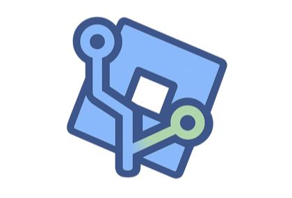

# RoGit - Git for Roblox Studio

**Full GitHub version control for Roblox Studio. Push, pull, diff, branch, and collaborate with others professionally without leaving the IDE.**

---

## About

RoGit brings real Git workflows to Roblox Studio. Connect any GitHub repository and manage your entire project with professional version control tools, all from a clean, in-editor UI built on the Catppuccin Mocha theme.

Built for teams and solo developers who want real version control without external toolchains like Rojo or manual file exports. RoGit handles serialization, conflict resolution, and collaboration features so you can focus on building your game.

---

## Why Choose RoGit?

### Zero External Tools

No CLI. No file watchers. No syncing folders. Connect your GitHub repo, click Push, and your project is versioned. Everything runs inside Studio with a native plugin UI.

### Smart Serialization

RoGit doesn't just dump raw data, it understands Roblox. Object references (PrimaryPart, Welds, Motor6D, Adornee) survive round-trips. Same-name siblings are disambiguated automatically. Path-unsafe instance names (`Foo/Bar`, `CON`, `Weird*?"<>|:Chars`, empty strings) are sanitized for git and restored on pull. Script metadata (Enabled, RunContext) persists via `.meta.json` sidecars.

### Safe by Design

Pull never overwrites your unpushed local edits, dirty files are preserved with a clear log message. Every pull and clone wraps in ChangeHistoryService, so one Ctrl+Z reverts the entire operation. A confirmation dialog prevents accidental Quick Pushes. Cold pulls are gated behind a remote cache fetch so conflict detection always works.

### Team Ready

Create and switch branches, open pull requests, monitor GitHub Actions, create tagged releases, and see your team's recent activity, all without leaving Studio.

---

## Feature Table

| Category | Feature | Description |
|---|---|---|
| **Connection** | Connect / Disconnect | Owner, repo, branch, PAT authentication |
| | Clone Repository | Supports `owner/repo` and `https://github.com/...` formats |
| | Remember Token | Persists PAT across sessions (opt-in) |
| | Masked PAT Input | Asterisk masking, selectable, paste-friendly |
| | First-Time Setup Wizard | 4-step guided onboarding with branch + remember token, auto-shows on first launch |
| | Saved Settings | Owner, repo, branch persist across sessions |
| **Git Core** | Push (Selective) | Checkbox per file (default unchecked), commit message, progress bar |
| | Push (Quick) | One-click push all with confirmation dialog and auto-generated message |
| | Pull | Downloads and applies remote changes while preserving unpushed local edits |
| | Pull (Cold Gate) | First pull after connect forces remote cache before applying, no blind overwrites |
| | Conflict Detection | Identifies files changed both locally and remotely |
| | Conflict Resolution | Side-by-side merge editor: Accept Theirs / Accept Mine per file |
| | Remote Delete | Files deleted on remote are removed locally on pull via reconciliation |
| | Branch Create / Switch | Dropdown in header, immediate switching |
| | Branch Merge | Merge any branch into current, conflict error handling |
| | Revert Commit | Hover R button on any commit in history |
| | Auto-Refresh Staging | Debounced, triggers on DescendantAdded/Removing with applyingRemote guard |
| | Undo Support | Every pull/clone wrapped in ChangeHistoryService, Ctrl+Z reverts the full operation |
| **Diff** | Diff Viewer | Float DockWidget, opens like a script tab |
| | File Sidebar | Lists changed files with [A]/[M]/[D] badges |
| | Syntax Highlighting | Full Luau tokenizer: keywords, strings, comments, numbers, types, operators |
| | Line Numbers + Gutter | Colored gutter bars, +/- prefixes |
| | Minimap | Right-side change distribution, clickable to jump |
| **History** | Commit History | Last 20 commits with hash, message, author, date |
| | File History | Per-file commit log via Explorer selection |
| **Collaboration** | Pull Requests | Create PR (title, body, base branch) + list open PRs |
| | Team Activity Feed | Recent commits as author/time/message feed |
| | GitHub Actions Status | Last 5 workflow runs with color-coded pass/fail |
| **Releases** | Tags / Releases | Create releases with tag, name, notes. List existing |
| **Search** | Search Across Files | Local grep through all serialized files, path:line results |
| **Serialization** | Scripts | `.server.luau`, `.client.luau`, `.luau` with `_init` folder pattern |
| | Instances | `.json` with properties, attributes, tags |
| | Object References | PrimaryPart, Part0/Part1, Attachment0/1, Adornee each deferred resolution on pull |
| | Same-Name Siblings | `__N` disambiguation with class-aware matching on apply |
| | Path-Safe Names | Reserved Windows name, special characters or even empty strings in any instance's name are all sanitized and restored |
| | Script Metadata | `.meta.json` sidecar for attributes, tags, Enabled, RunContext |
| | `_init` Sentinel | User-named `_init` instances safely escaped to `__init` and restored |
| | README.md | ServerStorage/README ModuleScript synced as `README.md` |
| | .gitignore | Per-service `_gitignore` ModuleScript with name patterns |
| | PackageLink | Serialized to JSON, restored via `InsertService:LoadPackageAsset` |
| **Project Setup** | Git Init | Creates README + `_gitignore` in all services |
| | Git Init Toolbar Button | Standalone toolbar action, opens output automatically |
| **UI / UX** | Catppuccin Mocha Theme | Dark theme, consistent across all panels |
| | Icon Buttons | Image-based section actions with hover tinting |
| | Tooltips | Hover labels on all icon buttons, auto-flip if near edge |
| | Scrollable Output | Per-line TextBox output with auto-tail and pinned-to-bottom tracking |
| | Header QoL | Buttons hidden when disconnected, home button for navigation |
| | Auto-Backup | 5-minute interval with help text, opt-in checkbox, persists across sessions |
| | Dropdown Dismiss | Click-catcher overlay closes dropdowns on outside click |
| | Confirm Dialog | Modal overlay with Cancel/Confirm for destructive actions |
| | Rate-Limit Aware | Skips metadata fetches for collapsed sections, reducing API calls by 60-70% |
| | ClickableWhenViewportHidden | Toolbar buttons work from Script Editor |
| **Architecture** | 11 Modules | App, Components, DiffEngine, GitHubClient, InstanceSerializer, DataTypes, PropertyMap, Theme, Types, Base64, Init |
| | 3 DockWidgets | Main (Right), Output (Bottom), Diff (Float) |
| | 3 Toolbar Buttons | RoGit, Output, Git Init |

---

## Installation

### From the Creator Hub

1. Install **RoGit** from the [Roblox Creator Hub](https://create.roblox.com/store)
2. Open Roblox Studio
3. Click the **RoGit** button in the toolbar

### From Source

1. Download `RoGit.rbxmx` from the [Releases](../../releases) page
2. Place it in your local plugins folder: `%localappdata%/Roblox/Plugins/`
3. Restart Roblox Studio

---

## Quick Start

### 1. Get a GitHub Personal Access Token

Go to [github.com/settings/tokens](https://github.com/settings/tokens) and create a **Classic** token with the `repo` scope. Copy it immediately, and store it somewhere safe. It's only shown once.

### 2. Open RoGit

Click the RoGit toolbar button. The 4-step setup wizard guides you through connecting:

1. **Welcome** - Overview of what RoGit does
2. **Token Guide** - Step-by-step PAT creation instructions
3. **Connect** - Enter owner, repo, branch, token, and hit Connect & Start

### 3. Push Your First Commit

1. Make changes in Studio (add a Part, edit a Script)
2. Open the **Changed Files** panel, your changes appear with `[A]`/`[M]`/`[D]` badges
3. Check the files you want to push
4. Write a commit message (e.g. "Initial commit") and click **Commit & Push**

### 4. Pull Remote Changes

Click the pull icon  to fetch and apply remote changes. If there are conflicts, the side-by-side resolver opens automatically.

---

## Requirements

- A GitHub account with a Personal Access Token (with the `repo` scope)
- A GitHub repository (public or private)

---

## Serialized File Structure

```
ServerScriptService/
  MyScript.server.luau            -- Script source
  MyScript.meta.json              -- Attributes, tags, Enabled, RunContext
  MyModule.luau                   -- ModuleScript
  MyFolder/
    _init.json                    -- Folder properties
    ChildPart.json                -- Part with properties, attributes, tags
    Wall.json                     -- First same-name sibling
    Wall__2.json                  -- Second (disambiguated)
Workspace/
  Model/
    _init.json                    -- Model properties (including PrimaryPart ref)
    Part.json
    WeldConstraint.json           -- With Part0/Part1 references
README.md                        -- From ServerStorage.README
```

---

## Known Limitations (v1)

- **Dotted instance names** (e.g., `v1.0.2`) may break object reference resolution
- **CRLF normalization** is not applied, cross-platform teams should agree on a line-ending convention
- **Conflict resolver** is whole-file only (no per-line merge)
- **Branch switching** during an in-flight operation may cause unexpected behavior

---

## License

MIT License - See [LICENSE](LICENSE) for details

---

## Credits

**Author:** **wharkk** ([@wharkk_](https://discord.com/users/629991962522681365))

**Portfolio:** [wharkk-developer.framer.website](https://wharkk-developer.framer.website)

Built with Luau. Powered by the GitHub REST API.
